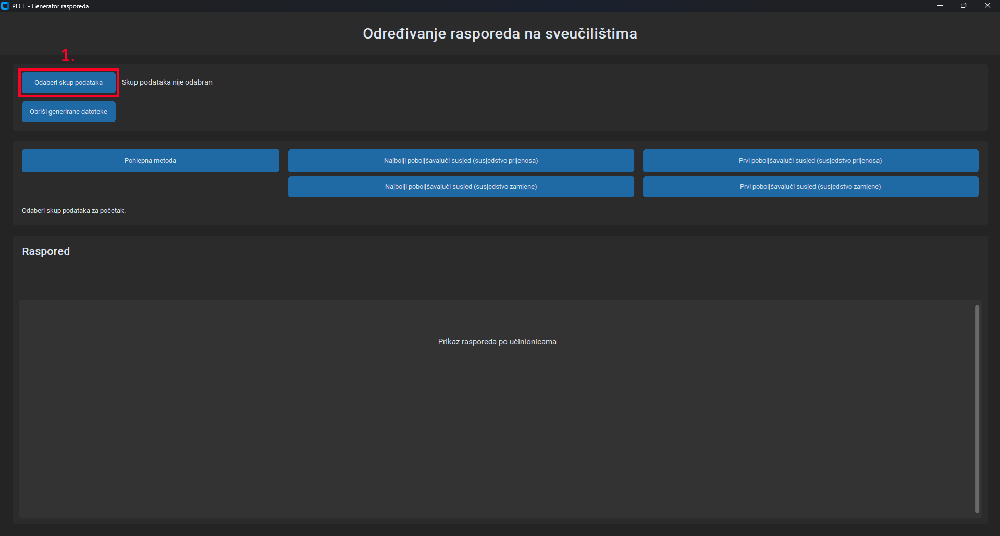
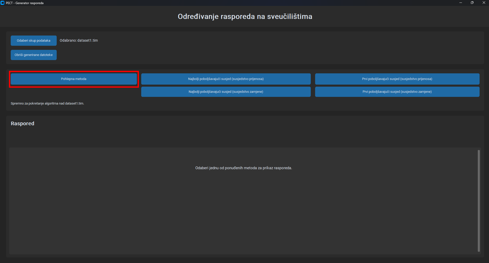
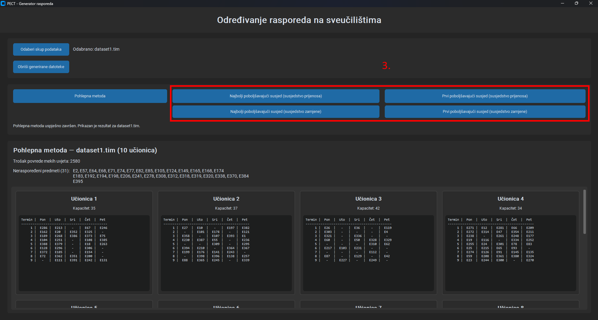
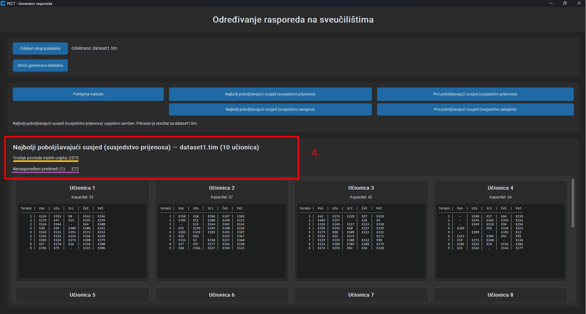
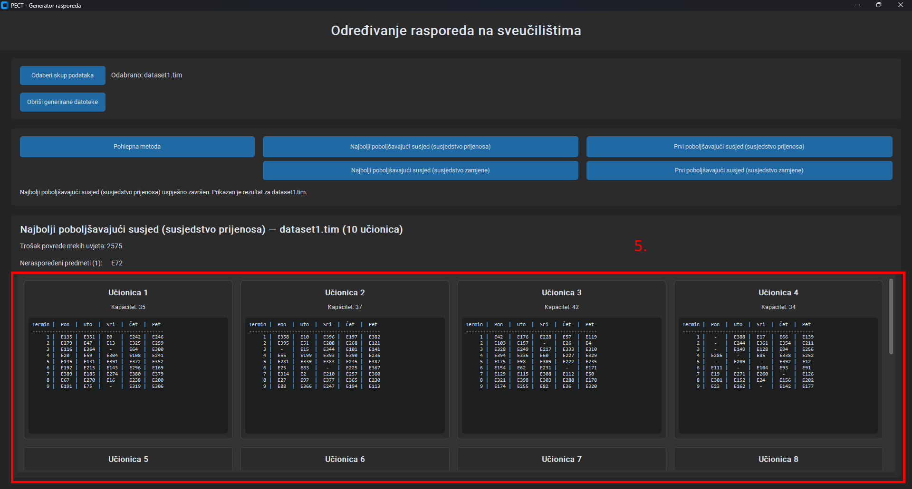
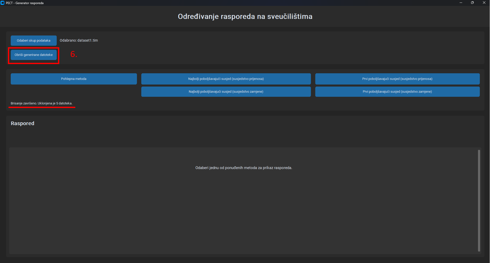

# Post-Enrolment Course Timetabling (PECT)

A university course timetabling application project developed for solving the **Post-Enrolment Course Timetabling (PECT)** problem. The project combines a Python/CustomTkinter GUI with C++ implementations of constructive and local-search based approaches.

> **Important:** Before running the application, install the GUI dependency:
>
> ```bash
> pip install customtkinter
> ```
>
> The project also requires a working **C++ compiler** and **Make** (`make` or `mingw32-make`), because the GUI builds the C++ solvers when an algorithm is started.

---

## Table of Contents

- [About the Problem](#about-the-problem)
- [Features](#features)
- [Algorithms](#algorithms)
- [How to install/start it](#how-to-install-&-start-it)
- [How to use the GUI](#how-to-use-the-gui)
- [Output and Evaluation](#output-and-evaluation)
- [Datasets](#-datasets)
- [Project Structure](#-project-structure)

---

## About the Problem

The **Post-Enrolment Course Timetabling** problem schedules university events after students have already selected the courses they want to attend. The timetable assigns each event a **timeslot** and a **room**, while respecting hard constraints and trying to minimize soft-constraint violations. This formulation was used as Track 2 of the Second International Timetabling Competition (ITC2007). The official problem description emphasizes that knowing student enrolments at timetable-construction time allows the timetable to be built around actual student choices.

In this project, each instance contains events, rooms, room features, students, event availability, student attendance information, and precedence requirements. The implementation works with the competition-style `.tim` datasets and 45 timeslots (5 working days × 9 periods), matching the assignment specification.


### Hard constraints

A valid timetable must respect the following constraints:

- Students cannot attend two events at the same time.
- An assigned room must have sufficient capacity and all required features.
- Two events cannot occupy the same room at the same timeslot.
- Events can only be scheduled in available timeslots.
- Precedence requirements between events must be respected where specified.

### Soft constraints

The project also evaluates undesirable timetable patterns:

- a student having an event in the last timeslot of a day
- three or more consecutive events in one day
- having only one event in a day

A solution may leave some events unplaced and still remain **valid**. The resulting **distance to feasibility** is the number of students who would attend the unplaced events. A solution with no unplaced events and no violated hard constraints is **feasible**.

### More about the problem and said competition:
- [ITC2007 – International Timetabling Competition](https://www.eeecs.qub.ac.uk/itc2007/index.htm)
- [ITC2007 – Post Enrolment Course Timetabling](https://www.eeecs.qub.ac.uk/itc2007/postenrolcourse/course_post_index.htm)
- [Official PECT problem description](https://www.eeecs.qub.ac.uk/itc2007/postenrolcourse/report/Post%20Enrolment%20based%20CourseTimetabling.pdf)

---

## Features

- CustomTkinter desktop GUI for selecting datasets and running algorithms
- Support for all 24 listed datasets (`dataset1.tim` ... `dataset24.tim`)
- Greedy timetable construction.
- Tabu Search used as a starting solution for local search.
- Four local-search configurations:
  - Best-improving Transfer
  - First-improving Transfer
  - Best-improving Swap
  - First-improving Swap
- Automatic timetable validation using `check.cpp` / `check.exe`
- Automatic calculation and display of hard-constraint and soft-constraint costs
- Room-by-room timetable visualization directly inside the GUI
- Automatic generation of solution files in the corresponding output directories

---

## Algorithms

### Greedy Method

The greedy solver parses the selected `.tim` instance, builds a conflict graph, constructs a timetable, validates it, and attempts to repair it when necessary. The resulting schedule is then evaluated and written to the greedy output directory.

### Tabu Search --- ili necemo spomenuti tabu igdje?

Tabu Search is used to produce a common starting solution for the local-search methods. The current implementation solves the selected dataset and stores the resulting schedule in `tabu_outputs`.

### Local Search

Two neighbourhood concepts are implemented:

**Transfer neighbourhood** — moves an event from its current assignment to another valid assignment

**Swap neighbourhood** — exchanges assignments between events

For both neighbourhoods the implementation provides:

- **Best-improving neighbour** — examines candidates and chooses the best improvement
- **First-improving neighbour** — stops at the first improving candidate

The executable accepts method numbers `1–4` for these combinations, while `-1` generates only the Tabu Search solution.

---

## How to install & start it

### 1. Clone the repository

```bash
git clone https://github.com/tinficok-faks/Post-Enrolment-Course-Timetabling.git
cd Post-Enrolment-Course-Timetabling
```

### 2. Install the Python GUI dependency

```bash
pip install customtkinter
```

### 3. Make sure the build tools are installed

The GUI searches for either `make` or `mingw32-make` and uses it to build the C++ projects. A working `g++` installation is also required because the validator is compiled automatically when the greedy method is started.

### 4. Start the application

```bash
python app.py
```

---

## How to use the GUI

### Step 1 — Select a dataset

Click **Select Dataset** and choose one of the available `.tim` files from the `datasets/` directory.

The current GUI expects files named `dataset1.tim` through `dataset24.tim`.

### Step 2 — Run an algorithm

Choose one of the available methods:

| GUI action | Description |
|---|---|
| **Greedy Method** | Constructs a timetable using the greedy approach. |
| **Best-improving Transfer** | Local search with Transfer neighbourhood. |
| **First-improving Transfer** | Local search with Transfer neighbourhood. |
| **Best-improving Swap** | Local search with Swap neighbourhood. |
| **First-improving Swap** | Local search with Swap neighbourhood. |

For local search, the application first prepares a Tabu Search solution and then uses it as the starting schedule.

### Step 3 — Inspect the result

After execution, the GUI displays:

- the selected algorithm and dataset;
- the number of unplaced events;
- the validation result;
- a room-by-room timetable covering the 45 available timeslots.

Each room is shown as a separate card containing its capacity and a compact Monday–Friday timetable.

### Step-by-step with pictures 

| | |
| :---: | :---: |
| Choosing dataset<br> | Starting greedy<br> |
| Choosing 1 of 4 local search algorithms<br> | 🟨 Total cost of hard or soft constraint violations<br> 🟪 Unsorted events<br> |
| Sorted events by room<br> | Deleting unwanted files after using a program<br> |

> To start algorithm after `Deleting unwanted files.. (6.)`, start `greedy (2.)` for app to build needed files.

---

## Output and Evaluation

The assignment requires the generated results to report:

| Value | Meaning |
|---|---|
| **Distance to Feasibility** | Total number of students associated with unplaced events. |
| **Soft Cost** | Number of violated soft constraints. |
| **Total Cost** | Distance to Feasibility + Soft Cost. |

For the project, a schedule with hard-constraint violations is treated separately from a valid timetable, while feasible solutions have distance to feasibility equal to `0`.

The validator reads the `.tim` input, checks room capacity/features, availability, precedence, student conflicts and room conflicts, and then evaluates the soft constraints.

The GUI interprets the validator return value as follows:

- positive value → soft-constraint cost;
- negative value → hard-constraint violations;
- zero → feasible timetable with no reported soft cost.

---

## 📁 Datasets

The assignment requires the available instances in the `datasets` directory to be used. The GUI currently accepts dataset numbers from **1 to 24** and expects the corresponding filenames `datasetN.tim`.

The official ITC2007 Post-Enrolment Course Timetabling page provides the problem model, instance information, input format, output format and validation resources.

---

## 📂 Project Structure

```text
Post-Enrolment-Course-Timetabling/
├── datasets/                         # ITC-style .tim problem instances
│   ├── dataset1.tim
│   ├── dataset2.tim
│   └── ...
│
├── greedy/                           # Greedy solver
│   ├── main.cpp                      # Solver entry point
│   ├── graph.*                       # Conflict graph representation
│   ├── parser.*                      # .tim instance parser
│   ├── timetable.*                   # Timetable construction/evaluation helpers
│   └── Makefile                      # Build rules
│
├── local_search/                     # Tabu Search + Local Search
│   ├── main.cpp                      # Algorithm entry point
│   ├── filereader.*                  # Input/solution loading
│   ├── tabu_search.*                 # Tabu Search implementation
│   ├── local_search.*                # Transfer and Swap neighbourhoods
│   ├── output.*                      # Solution writing helpers
│   └── Makefile                      # Build rules
│
├── greedy_outputs/                   # Greedy-generated solution files
├── tabu_outputs/                     # Tabu Search solution files
├── ls_outputs/
│   ├── ls1_outputs/                  # Best-improving results
│   └── ls2_outputs/                  # First-improving results
│
├── app.py                            # CustomTkinter GUI
├── check.cpp                         # Timetable validator
├── check.exe                         # Validator executable (generated/used on Windows)
└── README.md                         # Project documentation
```